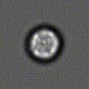
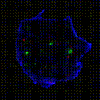
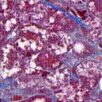
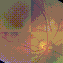
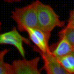
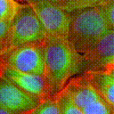

# Static2Dynamic: Reconstructing videos of unobservable cellular, developmental, and disease processes








<p align="center">
  <a href="https://biocompibens.github.io/static2dynamic">
    
  </a>
</p>


[](https://github.com/astral-sh/ruff)
[](https://github.com/biocompibens/static2dynamic/actions/workflows/pyright.yml)
[](https://github.com/biocompibens/static2dynamic/actions/workflows/ruff.yml)

## Installation with [`uv`](https://docs.astral.sh/uv/)

Install the environment with:

```sh
uv sync --frozen
```

## Configuration of Static2Dynamic

Static2Dynamic has 3 stages: pseudotime estimation, diffusion training, and video inference.

The configuration of each of these stages follows the same idea: a config *class* is defined in `GaussianProxy/conf/{pseudotime_conf,training_conf,inference_conf}.py`.
Users then pull these generic class definitions and *instantiate* user/machine-specific config *objects* under `my_conf/{my_pseudotime_conf,my_training_conf,my_inference_conf}.py`.

Examples can be found under `example_user_conf/`.

### Pseudotime estimation

The first stage (pseudotime estimation) is performed with the `GaussianProxy/pseudotime_estimation.py` script.

First, a user config must be created. Such a config is a `GaussianProx.conf.pseudotime_conf.Params` *object* and must be defined in a python file located at `my_conf/my_pseudotime_conf.py` and named `params`.

Then the pseudotime estimation script can be ran with the following command:

```sh
uv run GaussianProxy/pseudotime_estimation.py
```

### Diffusion training

The second stage (diffusion training) is performed with the `GaussianProxy/train.py` script.

First, a user config must be created. Such a config is a `GaussianProxy.conf.training_conf.Config` *object* and must be defined in a python file located at `my_conf/my_training_conf.py` and named `config`.

Then the diffusion training script can be ran with the following command:

```sh
uv run launcher.py run_name=<run_name> project=<project_name>
```

The launcher script takes care of copying the user config to the experiment folder and launching the actual distributed training script. It also supports SLURM clusters.

### Video inference

The third stage (video inference) is performed with the `GaussianProxy/inference.py` script.

First, a user config must be created. Such a config is a `GaussianProxy.conf.inference_conf.InferenceConfig` *object* and must be defined in a python file located at `my_conf/my_inference_conf.py` and named `inference_conf`.

Then the video inference script can be ran with the following command:

```sh
uv run GaussianProxy/inference.py
```
